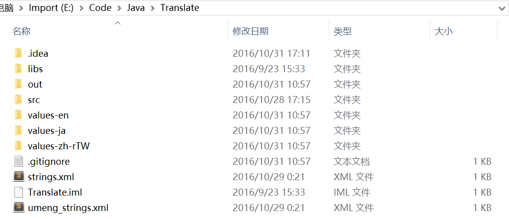
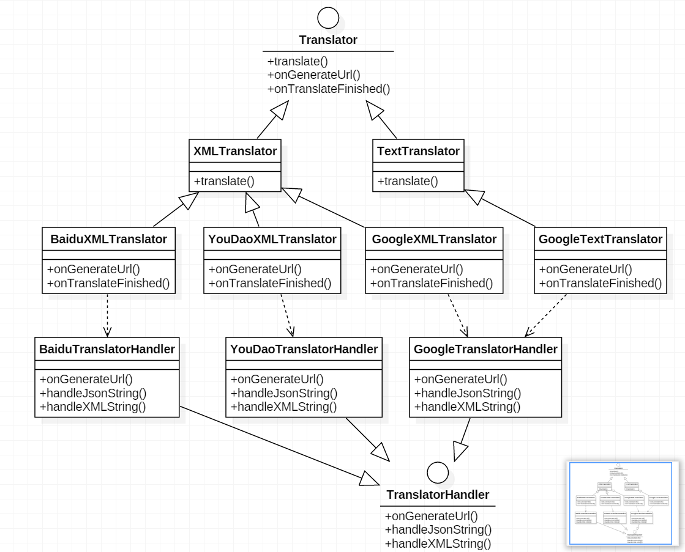

Android string.xml 翻译工具
===========================

**这个老版的工具将不再维护。最新版已发布，基于插件的形式，你可以轻松的开发插件来选择你要使用的翻译平台，
你也可以发开自己的文档解析插件，然后将文档解析插件和翻译平台插件任意组合更加灵活。项目地址在这里：
https://github.com/onlynight/exchange**

Android strings.xml translate tools
===================================

**This project will not support. The new version of Translator now released, it is plugin based,
you can simply develop you own plugins to access translate platform and parse typed text document.
You will fall in love with this new project. Follow me here:
https://github.com/onlynight/exchange**

# 概述
最近要把公司的app往国外推广，无奈只做了中文版，好在所有的字符串都是写在string.xml文件中的，为了快速推出海外版本，决定有机器翻译先做一个简单的版本。说到这里问题就来啦，这么多文本难道一句一句的复制粘贴呀，当然写个小工具翻译既省时又省力。想法有了找一下翻译平台，首先想到google但是google要翻墙对网络环境不太好的小伙伴要求太高，所以想到了国内的百度翻译和有道翻译。

当你需要快速翻译string.xml资源字符串中的文本时你就可以使用这个工具啦，这个工具还支持拓展，只需简单几部就能完成拓展，下面我们就来详细介绍下这个工具的实现以及拓展方法。

# 使用

使用前你需要配置各个平台的key，在{@link com.github.onlynight.android.string_xml.translate.utils.Constants}类中对平台的key进行配置，平台文档地址：

- google https://cloud.google.com/translate/v2/quickstart
- 百度 http://api.fanyi.baidu.com/api/trans/product/apidoc
- 有道 http://fanyi.youdao.com/openapi

在```Main.java```中有使用的demo，你可以参考demo中的代码，如果你需要自定义翻译文件你需要做做如下操作：

### 1.初始化```TranslateManager```
使用前需要先初始化翻译管理器，需要注意的是，如果你要切换其他平台翻译的话你需要重新初始化。

```java
TranslateManager.getInstance().
	init(currentPath.getAbsolutePath(),
	translateAllXml, TranslatePlatform.GOOGLE);
```

- 第一个参数是要翻译的路径，demo中传入的是项目的根目录
- 第二个参数标识是否要翻译该目录下的所有xml文件
- 最后一个参数标识翻译平台

### 2.调用翻译函数
初始化完成后就可以开始翻译了：

```java
TranslateManager.getInstance().translate(Language.CN, Language.EN);
```

- 第一个参数是源语言
- 第二个参数是要翻译的目标语言

### 3.查看翻译结果
调用翻译函数后查看日志直到翻译完成为止，目标文件生成在指定的翻译目录下```values-xxx```文件夹中。




**注意：**
目前只支持在Intellij Idea中运行，打包成jar文件执行时文件乱码问题暂未解决，所以你需要安装Intellij Idea运行工程。

# 实现以及结构分析
首先我们先来看下类图：



很明显实现Translator的类和间接实现的类是一个标准的适配器模式，适配器模式可以将多种实现协调在一起工作，这样就可以实现不止XML解析并翻译，还可以实现其文件类型的翻译，比如```TextTranslator```。下面这一层```TranslatorHandler```将每个翻译平台的公共操作抽象出来，然后每个平台的具体实现都有一个实现类。之所以没有把这些具体的操作放在具体的Translator类中，是因为这些操作和具体的```Translator```的实现无关，这样分离以后代码复用效率高。

这张类图清晰的展示了整个项目的类结构：

1. 首先，先声明一个接口```Translator```这个类中定义了抽象操作以及一些公共方法。```translate```方法就是公共翻译入口，调用这个方法就是翻译；```onGenerateUrl```方法中需要返回平台REST_API所需的完整请求url，其调用时机应该在translate方法中（或者在其过程的方法中）；```onTranslateFinished```调用REST_API返回String时对这个String进行json或者xml化处理，视实际情况而定。
2. ```TypedTranslator```这一层类是每一种翻译器的抽象实现类，这一层中实现了具体的平台的功能，但是每个```Translator```又会去调用平台特定的```TranslatorHandler```，```TranslatorHandler```中将平台的公共操作抽象出来提高复用。
3. ```TranslatorHandler```中实现各个平台自己的实现，```onGenerateUrl```需要返回平台REST_API所需的完整请求url，```handleJsonString```中返回处理json string的结果，```handleXMLString```返回处理xml string的结果，这两个函数视情况而定，根据平台的返回值看需要哪个函数，或者两个都实现。

上面分析了该工具的主要结构，下面来说一下其他的辅助类：

- ```TranslatorManager```
翻译管理器，同一管理平台初始化以及调用翻译平台翻译。
- ```TranslatorPlatform```
定义翻译平台
- ```Language```
定义翻译语言
- ```Constants```
定义常用全局变量，比如平台key等其他静态配置。

# 拓展
简要说明在```Main.java```文件中已说明，下面视详细说明：

## 1.定义平台
如果你要拓展新的翻译平台，你需要在{@link com.github.onlynight.android.string_xml.translate.translator.TranslatePlatform}中添加新的平台，这是定义平台的第一步，后续还要做一些和平台相关的配置。

## 2.拓展```XMLTranslator```
继承自```XMLTranslator```类并实现它的所有抽象方法，我们暂时命名为```PlatformXMLTranslator```。```PlatformXMLTranslator```实际上只是一个代理类，但是为了方便拓展其他的功能并没有实现```Translator```接口，而是重新定义接口尽量使函数名称相似。

## 3.实现```TranslatorHandler```
新添加的平台需要实现一个```TranslatorHandler```，这个类中定义了每个平台具体的操作。```onGenerateUrl```返回最终的请求平台的url，根据平台不同的规范拼接生成REST_API的url。```handleJsonString```和```handleXMLString```两个方法，这里暂时定义两种不同的返回结果处理函数，你也可以根据你的需求拓展这些接口。在```PlatformXMLTranslator```中实例化这个```TranslatorHandler```并在对应的方法中调用handler中对应的方法。

## 4.注意
目前只添加了简体中文，繁体中文，英文，日文集中语言，如果你需要添加其他语言你需要做以下几件事：

1. 在{@link com.github.onlynight.android.string_xml.translate.translator.TranslatePlatform}中新建一个平台，并且将新添加的平台配置到{@link com.github.onlynight.android.string_xml.translate.utils.Constants}类中的platformConfig中去，具体方法参考其他平台配置。
2. {@link com.github.onlynight.android.string_xml.translate.translator.Language}中添加新的语言这里使用的是google翻译平台标准简称，如果你使用其他平台需要将简称转换以下，参考{@link com.github.onlynight.android.string_xml.translate.translator.xmlImpl.BaiduXMLTranslator}中的转换方法。
3. 你需要在{@link com.github.onlynight.android.string_xml.translate.utils.Constants}中配置valuesFolders，添加不同语言对应的文件夹。


[Github_Source]: https://github.com/onlynight/Translator
